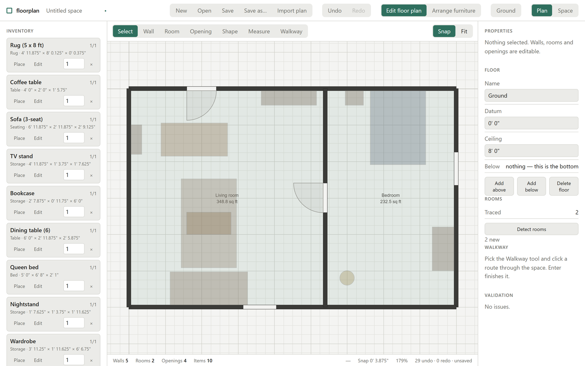
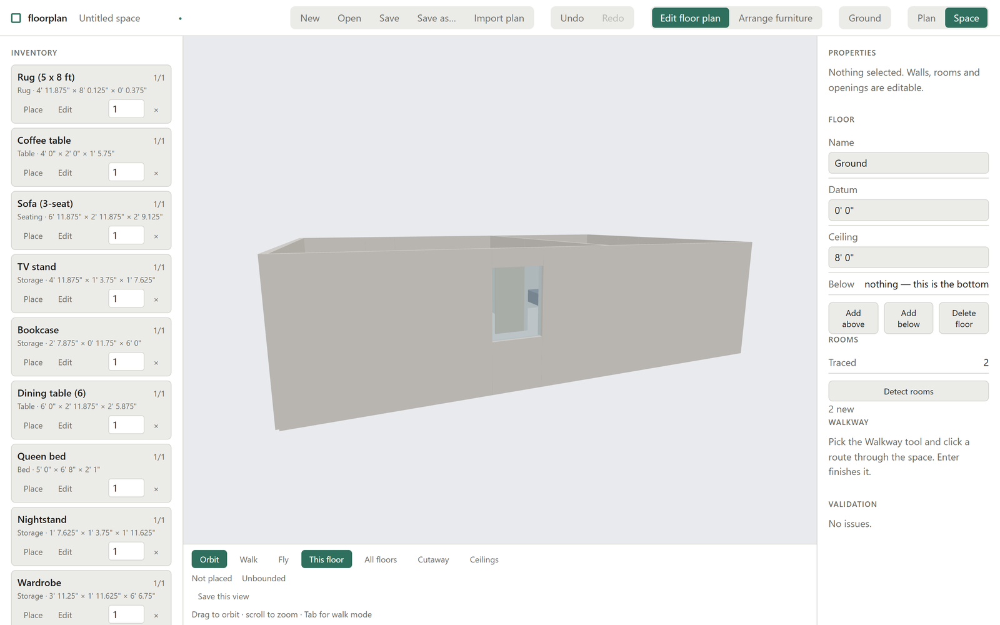
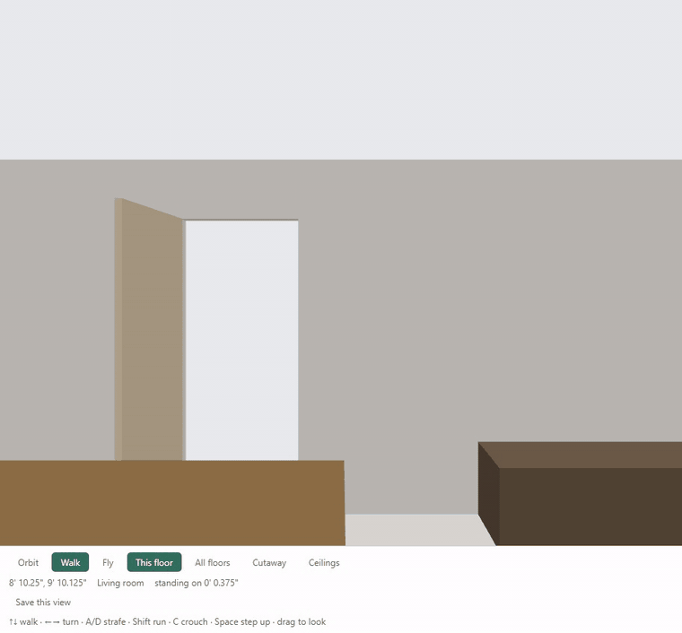
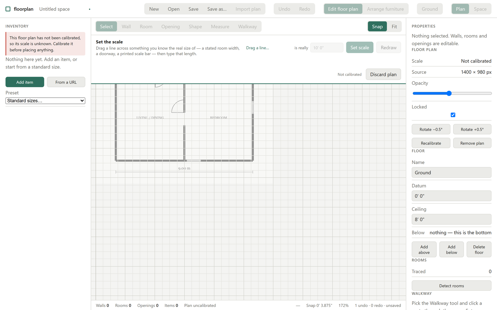
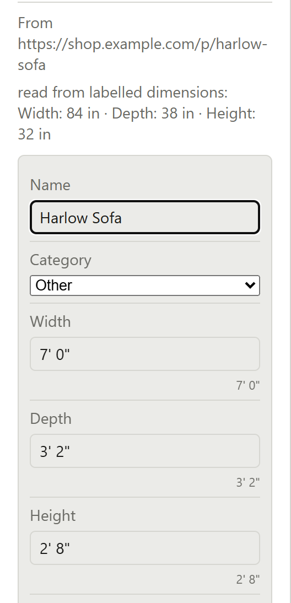
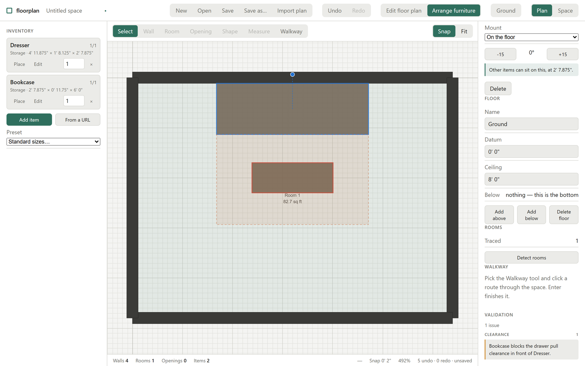

# floorplan

Spatial planning for real rooms. Bring a floor plan — a PDF, an image, or nothing at
all — trace it, build an inventory of the things you own, place them, and walk through
the result in 3D. Import and calibration, the plan editor, inventory and placement, the
space view, door swing, clearance and circulation, room detection and floor stacking,
save-in-place and crash recovery.

**One decision explains most of the rest of it.** Every object carries a real height and
a real base elevation, and the geometry is three-dimensional everywhere rather than a
plan with a height column bolted on. A rug under a coffee table is not a collision. A
wall shelf at 1400mm does not block a desk at 750mm. A 2100mm bookcase under a 2050mm
soffit is a violation the app catches. You walk *over* the rug, *under* the doorway's
lintel and *into* the dresser, with no special case for any of them — the walker is a
vertical interval tested against other vertical intervals, and a doorway is passable
because the only solid above it starts at 2032mm.

Everything below follows from that, and from one more thing: the plan view is where you
build and the space view is where you find out. Neither is the real one. Both read and
write the same document.

| View | For | Renderer |
|------|-----|----------|
| **Plan**, 2D top-down | authoring — tracing, dimensioning, placing, measuring | Konva |
| **Space**, 3D | verification — sightlines, headroom, how it actually feels | three.js |

---

## The plan view



Draw walls and let detection find the rooms, or trace rooms directly. Cut doors and
windows into walls by clicking the wall. Everything is integer millimetres; the display
unit is a view preference and never touches a calculation.

Tools are `V` select, `W` wall, `R` room, `O` opening, `S` shape, `D` dimension,
`P` walkway probe. `G` toggles the grid, `Alt` suppresses snapping while held, `[` and
`]` rotate the selection in 15° steps, `Enter` finishes a wall chain, `Ctrl+Z` undoes.
One drawn wall is one undo, not the several hundred mouse-move events that drew it.

## The same document in 3D



The 3D view is derived, never authored. Openings are cut in *elevation*, not in plan, so
a wall with a door in it is not a wall with a hole — it is the four solid boxes that
remain around the opening: flank, sill wall, lintel, flank. The same list of boxes is
handed to the renderer, to the walker and to the validation panel, which is what stops
the drawing and the collision test disagreeing about where the doorway is.

## Walking through it



Click **Space** in the top bar, then **Walk** in the view HUD, or press `Tab` to cycle
orbit → walk → fly. The readout names the room you are standing in and what you are
standing on — in that clip, a 10mm rug.

| Key | Does |
|-----|------|
| `Tab` | cycle orbit → walk → fly |
| `↑` `↓` / `W` `S` | walk forward and back |
| `←` `→` / `Q` `E` | turn |
| `A` `D` | strafe |
| `Shift` | run |
| `C` | crouch — duck under a wall shelf |
| `Space` | step up — clear something knee-high |
| `R` `F` | rise and fall, in fly mode |
| drag | look around |

The walk simulation deliberately lives *outside* three.js: a plain `requestAnimationFrame`
loop over pure functions, so the camera consumes the walker rather than owning it. The
position readout survives a browser with no WebGL, and traversal is testable without a
GPU.

## Getting a plan in



Import a PDF or an image and the app blocks until you tell it the scale: drag a line
across something whose real length you know, then type that length. Nothing downstream
can correct a plan with no scale, so nothing downstream is offered — the tools grey out,
and `addPlacement` throws rather than accepting an item into a document that cannot say
how big it is.

An uncalibrated background is shown at a nominal 6m width, so the reference line is
drawable before a real scale exists. Calibrating rescales about the point you anchored
on, so that point does not move. Import does not re-fit the viewport, on purpose.

## Inventory

Enter items by hand, or start from the preset library — real published sizes, a US queen
mattress at 1524 × 2032mm because it is 60" × 80". Every field parses any unit: `1.8m`,
`30"`, `2' 6"`, or a bare number in the document's display unit, echoed back so you can
see what it understood.



A product URL can be looked up instead, and the answer is never taken on trust. The
parser refuses a unitless number. What was scraped is shown next to the fields it filled,
along with the text it came from, and nothing enters the inventory until you press Add.
The lookup endpoint runs server-side only; with it absent the app is fully functional and
says so, which is the behaviour a static deployment gets.

## What has to stay clear



Two checks that sound alike and are not. A **clearance zone** asks whether a drawer opens
— 900mm in front of a dresser, 1067mm behind a dining chair, 1200mm at an appliance door.
A **walkway probe** asks whether a person fits. They differ on whether walls count: they
do not for a zone, they do for the probe.

Zones are drawn on the selected item only. A warning that says "the bookcase blocks the
drawer pull" is an argument, and the hatched rectangle is the evidence — but six dining
chairs with pull-out zones would carpet the floor in hatching and say nothing. The probe
stores the *route*, not the number, so it re-answers as furniture moves.

The validation panel groups by what you would do about a problem rather than by which
enum the issue came from.

---

## Quick start

```bash
pnpm install
pnpm dev            # http://localhost:5190
```

| Script | Does |
|--------|------|
| `pnpm dev` | Vite dev server, with the product-lookup endpoint |
| `pnpm build` | Typecheck, then production build |
| `pnpm preview` | Serve the production build — no lookup endpoint, like a static deploy |
| `pnpm typecheck` | `tsc --noEmit` |
| `pnpm lint` | ESLint |
| `pnpm test` | Vitest — 768 unit tests |
| `pnpm test:watch` | Vitest in watch mode |
| `pnpm e2e` | Playwright — 124 end-to-end tests, against a production build |
| `pnpm e2e:install` | One-time Playwright browser install |
| `pnpm media` | Redraw every picture in this README (needs `ffmpeg`) |

## Layout

```
src/
├── core/          pure logic — units, geometry, document model, tools, validation
├── state/         zustand store: document slice (undoable) + editor slice (not)
├── server/        the product-lookup endpoint
├── ui/            React shell, panels, dialogs
│   ├── plan/      Konva stage and its layers
│   └── space/     three.js scene, camera rig, walk loop
└── styles/        global CSS
e2e/               Playwright specs
media/             the capture script behind docs/media
PLAN.md            architecture, decisions, the phasing table, and what is
                   deliberately out of scope for v1
```

`src/core/` is free of React and of any renderer. The geometry engine is pure functions
over integer millimetres, consumed identically by the Konva plan view, the three.js space
view and the validation passes — which is what keeps one geometry primitive serving all
three.

## Conventions

- **Integer millimetres** everywhere in `src/core/`. Display units are a view preference
  and never used for computation.
- The document is Z-up (`x` east, `y` south, `z` up). three.js is Y-up. The conversion
  lives in exactly one place and is tested both directions.
- Rotation is never baked into stored vertices. Footprints stay in local coordinates;
  world geometry is derived per query.
- **Document state is undoable; editor state is not.** A drag lives entirely in the editor
  slice and writes to the document once, on release.
- Coordinates round to integer millimetres at the commit boundary, never during a drag —
  rounding mid-gesture makes geometry jitter against the cursor.

---

## The pictures

Every image above is generated by driving the real application — `media/capture.spec.ts`,
run with `pnpm media`, which builds the scene through the same screen-to-document mapping
the end-to-end suite uses, photographs it, and encodes the clip with ffmpeg. Each capture
asserts the state it is photographing: the walk clip fails if the walker does not reach
the bedroom, the clearance shot fails if the issue is not listed.

That is the whole reason it exists. A hand-taken screenshot of a feature that has since
changed is a lie the repository tells silently, and it tells it for years.
